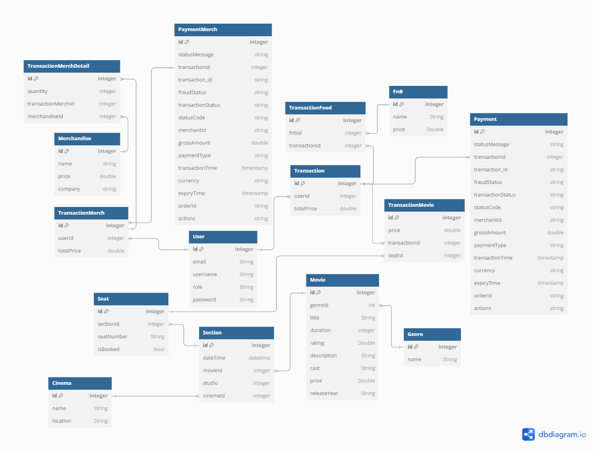

# Spring Boot Applications With Docker and Kubernetes 

An application called Cnema has two user roles: admin and customer. The admin role can manage or organize cinema-related data such as adding, deleting, and modifying data for film genres, films, cinemas, theaters, daily film screening sessions, food and beverages (FnB), merchandise, and viewing customer transactions. The customer role can view lists of film genres, films (with various filters), FnB, and merchandise from a film, as well as make transactions to purchase tickets (for more than one seat), FnB, and merchandise. Payments are simulated using the Midtrans Payment Gateway with the payment type being e-wallet (Gopay using Qris).

## Prerequisites 
1. Java JDK 17 
2. PostgreSQL
3. Maven
4. Docker
5. Kubernetes
6. Midtrans (Payment Gateway)

## Entity Relationship Diagram

 

## Run Program 

### 1. Local 

   - Create a local database then change the project configuration in the "makefile"

     ```
     DB_USERNAME := {your database username}
     DB_PASSWORD := {your database password}
     DB_NAME := {your database name} 
     ```

   - Create a project in midtrans for demo or payment simulation with a sandbox environment then change the "makefile" in the client-key and server-key section according to the key in the midtrans dashboard
  
     ```
     CLIENT_KEY := {your midtrans client-key}
     SERVER_KEY := {your midtrans server-key}
     ```
     
   - Run the following command in the terminal in the project root directory (where there is a "makefile" file) :
  
     ```
     make all
     ```

   - After all the processes are complete, your program will be able to run locally and a file with the .jar extension will be formed
     
### 2. Deploy With Docker on Server 

   - Make sure the file with the .jar extension has been built
   - Create a ``` dockerfile ``` with following content : 
  
     ```
     FROM openjdk:17-jdk-alpine
     COPY target/*.jar app.jar
     CMD ["java", "-jar", "/app.jar"]
     ```

   - Create ``` .env ``` with following content
  
     ```
     DB_HOST=db
     DB_PORT=5432
     DB_NAME={your database name}
     DB_USER={your database username}
     DB_PASSWORD={your database password}
     JWT_SECRET={your JWT_SECRET}
     JWT_EXPIRATION={your JWT_EXPIRATION}
     CLIENT_KEY={your midtrans CLIENT_KEY}
     SERVER_KEY={your midtrans SERVER_KEY} 
     ```    
     
   - Create ``` docker-compose.yaml ``` with following content
  
     ```
     services:
        app:
          build: . # pastikan dockerfile berada dalam path yang sama dengan docker-compose
          env_file:
            - .env # pastikan .env berada dalam path yang sama dengan docker-compose
          ports:
            - "8080:8080"
          depends_on:
            db:
              condition: service_healthy  # Pastikan db sehat sebelum app dimulai
      
        db: # digunakan sebagai DB_HOST
          image: postgres:alpine
          env_file:
            - .env # pastikan .env berada dalam path yang sama dengan docker-compose
          environment:
            POSTGRES_USER: ${DB_USER} # pastikan pada .env user dan db sama
            POSTGRES_PASSWORD: ${DB_PASSWORD}
            POSTGRES_DB: ${DB_NAME} # pastikan pada .env user dan db sama
          volumes:
            - {your app}-volume:/var/lib/postgresql/data
          healthcheck:
            test: ["CMD-SHELL", "pg_isready -U ${DB_USER}"]
            interval: 10s
            timeout: 5s
            retries: 5
      
      volumes:
        {your app}-volume:
          name: {your app}-volume
     ```

   - Put the four files in one folder and copy the folder to your server
  
     ```
     scp -i {key} /{path}/{your local folder} {user_server}@{ip_address_server}:~/
     ```
     
   - Go to the folder that has been copied on the server and run the following command :
  
     ```
     docker compose up -d --build
     ```

   - Make sure all containers are UP and have been properly exposed
  
     ```
     ps -a
     ``` 
  
   - Test your application on Postman
  
### 3. Kubernetes 

   - Push image docker anda di docker hub repository
   - Make sure you have the ``` config.yaml ``` to connect to the Kubernetes cluster, make sure it can be accessed

     ```
     kubectl --kubeconfig=/path/.kube/*.yaml config current-context

     kubectl --kubeconfig=/path/.kube/*.yaml get nodes
     ```

   - In this project there is already a k8s folder for kubernetes, change the configuration according to your application
   - Change the ``` app-config.yaml ``` file according to your application
  
     ```
     // Apply 
     kubectl --kubeconfig=/path/.kube/*.yaml apply -f k8s/app-config.yaml

     // Check
     kubectl --kubeconfig=/path/.kube/*.yaml get cm 
     ```
     
   - Change the ``` app-secret.yaml ``` file according to your application. Remember that all data in this file is confidential so it needs to be encoded to base64 with the command ``` echo -n "text to be encoded" | base64 ```
  
     ```
     // Apply 
     kubectl --kubeconfig=/path/.kube/*.yaml apply -f k8s/app-secret.yaml

     // Check
     kubectl --kubeconfig=/path/.kube/*.yaml get secret
     ```
     
   - Change the ``` pvc-storage.yaml ``` file according to your application
  
     ```
     // Apply 
     kubectl --kubeconfig=/path/.kube/*.yaml apply -f k8s/pvc-storage.yaml

     // Check
     kubectl --kubeconfig=/path/.kube/*.yaml get pvc 
     ```

     Make sure it's **bounding**
     
   - Change the ``` db-deployment.yaml ``` file according to your application

     ```
     // Apply 
     kubectl --kubeconfig=/path/.kube/*.yaml apply -f k8s/db-deployment.yaml

     // Check
     kubectl --kubeconfig=/path/.kube/*.yaml get pods 
     ```

     Make sure it's **running**
     
   - Change the ``` db-service.yaml ``` file according to your application

     ```
     // Apply 
     kubectl --kubeconfig=/path/.kube/*.yaml apply -f k8s/db-service.yaml

     // Check
     kubectl --kubeconfig=/path/.kube/*.yaml get svc  
     ```

   - Change the ``` app-deployment.yaml ``` file according to your application

     ```
     // Apply 
     kubectl --kubeconfig=/path/.kube/*.yaml apply -f k8s/app-deployment.yaml

     // Check
     kubectl --kubeconfig=/path/.kube/*.yaml get pods 
     ```

     Make sure it's **running**
     
   - Change the ``` app-service.yaml ``` file according to your application

     ```
     // Apply 
     kubectl --kubeconfig=/path/.kube/*.yaml apply -f k8s/app-service.yaml

     // Check
     kubectl --kubeconfig=/path/.kube/*.yaml get svc  
     ```
     
      Make sure the ``` app-service ``` already has an ``` EXTERNAL-IP ```, External IP that will be used for external access.
